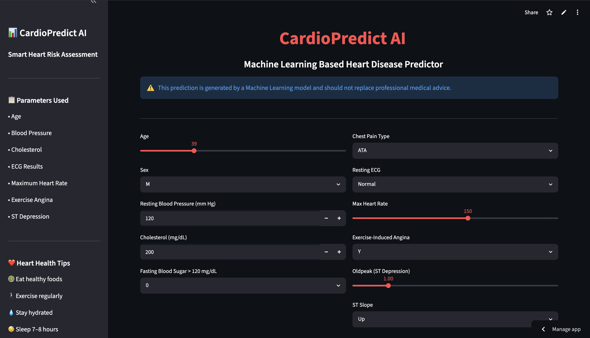
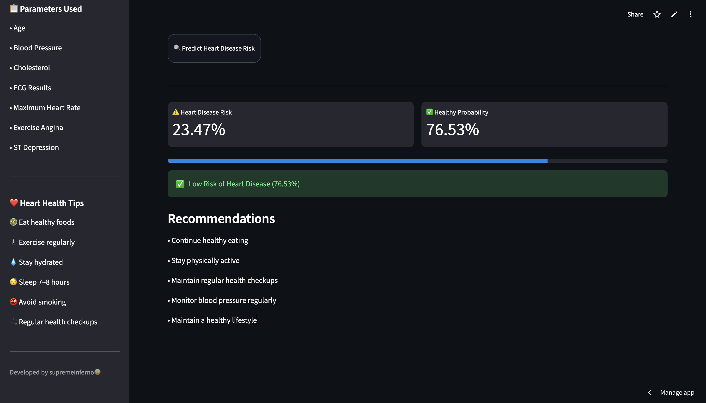

# 🫀 Swasya

### 🩺 Smart Heart Disease Risk Assessment using Machine Learning

<p align="center">


</p>
<p align="center">
  <b>Predict heart disease risk using Machine Learning and interactive data-driven insights.</b>
</p>

---

## Live Demo

🔗 **Try the application here:**

https://swasya.vercel.app

---

## 📌 Project Overview

CardioPredict AI is a Machine Learning-powered healthcare application designed to estimate the probability of heart disease using clinical and lifestyle parameters.

The application utilizes a Support Vector Classifier (SVC) model with probability estimation enabled, allowing users to receive risk scores rather than simple binary predictions.

The project combines data preprocessing, feature engineering, machine learning, and an interactive Streamlit dashboard to create an intuitive cardiovascular risk assessment tool.

> ⚠️ **Disclaimer:** This application is intended for educational and research purposes only and should not be considered a substitute for professional medical advice.

---

## Application Preview

### Home Dashboard

<p align="center">
  
</p>

### Prediction Results

<p align="center">
  
</p>

---

## Features

Interactive Streamlit Dashboard

Heart Disease Risk Prediction

Probability-Based Risk Assessment

Personalized Health Recommendations

Modern Dark-Themed User Interface

Interactive Sliders and Dropdown Controls

Health Awareness Tips Sidebar

Real-Time Predictions

Responsive Design

Confidence Score Visualization

---

## Dataset Information

The model was trained on a heart disease dataset containing:

| Attribute       | Value        |
| --------------- | ------------ |
| Records         | 918          |
| Features        | 11           |
| Target Variable | HeartDisease |

### Features Used

* Age
* Sex
* ChestPainType
* RestingBP
* Cholesterol
* FastingBS
* RestingECG
* MaxHR
* ExerciseAngina
* Oldpeak
* ST_Slope

---

## Data Preprocessing

The following preprocessing steps were performed:

* Data Cleaning
* Handling Missing Values
* Categorical Feature Encoding
* Feature Scaling using StandardScaler
* Train-Test Split (80:20)
* Random State = 42

---

## Machine Learning Models Evaluated

Multiple machine learning algorithms were trained and compared.

| Model                           | Accuracy |
| ------------------------------- | -------- |
| Logistic Regression             | 86.41%   |
| Support Vector Classifier (SVC) | 85.33%   |
| K-Nearest Neighbors (KNN)       | 85.33%   |
| Gaussian Naive Bayes            | 84.78%   |
| Decision Tree Classifier        | 78.80%   |

---

## Final Model

The deployed application uses:

```python
from sklearn.svm import SVC

model = SVC(
    kernel='linear',
    random_state=42,
    probability=True
)
```

### Why SVC?

Although Logistic Regression achieved the highest accuracy, SVC was selected because probability estimation was enabled (`probability=True`).

This allows the application to provide:

* Risk Percentage
* Healthy Probability
* Confidence-Based Predictions
* Better User Experience

rather than only returning a binary output.

---

## Technology Stack

### Programming Language

* Python

### Libraries

* Pandas
* NumPy
* Scikit-Learn
* Plotly
* Joblib

### Framework

* Streamlit

---

## Machine Learning Pipeline

```text
Dataset
   ↓
Data Cleaning
   ↓
Feature Encoding
   ↓
Train-Test Split
   ↓
Feature Scaling
   ↓
Model Training
   ↓
SVC Classification
   ↓
Probability Prediction
   ↓
Streamlit Deployment
```

---

## Project Structure

```text
heart-disease-prediction/
│
├── app.py
├── heart.csv
├── heart_attack.ipynb
├── SVC_model.joblib
├── scaler.joblib
├── columns.joblib
├── requirements.txt
├── README.md
│
└── assets/
    ├── home.png
    └── prediction.png
```

---

## Installation

### Clone Repository

```bash
git clone https://github.com/supremeinferno/heart-disease-prediction.git
```

### Navigate to Project Directory

```bash
cd heart-disease-prediction
```

### Install Dependencies

```bash
pip install -r requirements.txt
```

### Run Streamlit Application

```bash
streamlit run app.py
```

---

## Future Improvements

* Explainable AI using SHAP
* Feature Importance Visualization
* Deep Learning Models
* User Authentication
* Medical Report Export
* Cloud Database Integration
* Mobile-Friendly Dashboard

---

## 👨‍💻 Author

### Pranav Garg

Passionate about:

* Machine Learning • Computer Vision • Deep Learning • Agentic AI 

🔗 GitHub: https://github.com/supremeinferno
